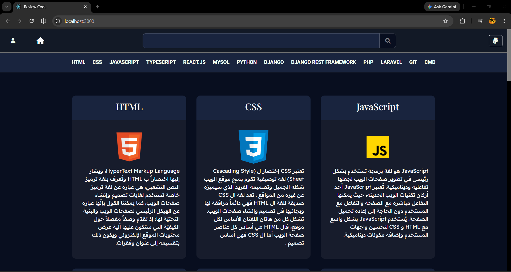
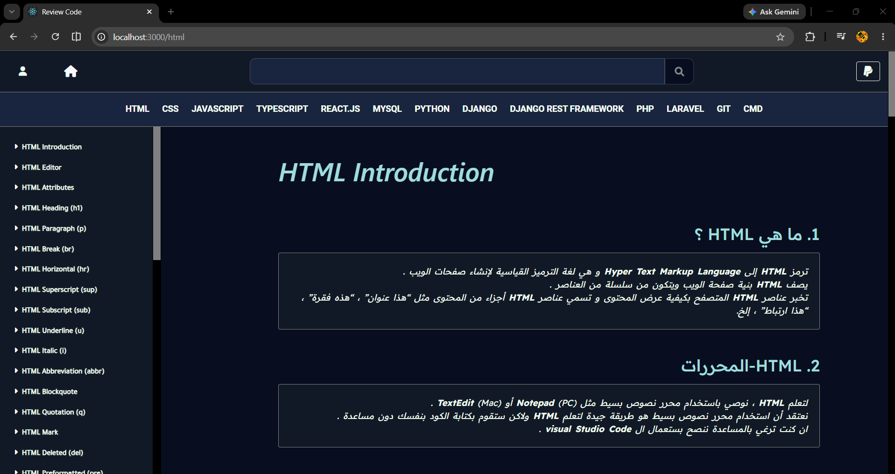

# 🚀 Reda Eskouni Portfolio
[](https://redafarissi.github.io/rv/)  

## 🔗 Live Demo:

➡️ [https://redafarissi.github.io/rv/](https://redafarissi.github.io/rv/) ⬅️ 




# RV - Programming Learning Platform

RV is a web platform designed for developers and programming learners. It provides programming tutorials, coding questions, search functionality, and a community-driven Q&A system.

## Features

- Programming tutorials and learning resources
- HTML, CSS, JavaScript, TypeScript
- React.js
- Python
- Django
- Django REST Framework
- PHP
- Laravel
- MySQL
- Git
- PowerShell / CMD
- User authentication (Login & Register)
- Search functionality
- Add and manage programming questions
- Question detail pages
- Error reporting system
- PayPal integration

## Tech Stack

### Frontend

- React 18
- React Router DOM
- Redux
- Sass
- Axios
- React Syntax Highlighter

### Backend

- Django
- Django REST Framework

### Payment

- PayPal API

## Installation

Clone the repository:

```bash
git clone https://github.com/RedaFarissi/rv.git
cd rv
```

Install dependencies:

```bash
npm install
```

Start the development server:

```bash
npm start
```

Build for production:

```bash
npm run build
```

## Project Structure

```text
src/
├── components/
│   ├── html/
│   ├── css/
│   ├── js/
│   ├── typescript/
│   ├── react/
│   ├── python/
│   ├── django/
│   ├── django_rest_framework/
│   ├── php/
│   ├── laravel/
│   ├── mysql/
│   ├── git/
│   ├── login/
│   ├── register/
│   ├── search/
│   ├── addQuestion/
│   ├── allQuestion/
│   └── questionDetail/
│
├── App.jsx
└── main.jsx
```

## Main Pages

- Home
- Search
- Login
- Register
- My Page
- All Questions
- Add Question
- Question Details
- Report Error

## Future Improvements

- User profiles
- Question voting system
- Comments and replies
- Dark mode
- Course progress tracking
- Notifications

## Author

**Reda Eskouni**

GitHub:
https://github.com/RedaFarissi

---

If you find this project useful, consider giving it a ⭐ on GitHub.
